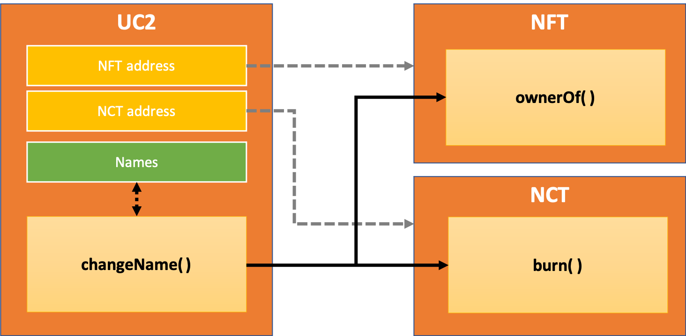

# NCT usage examples

##  1. Introduction 

This repository is intended to provide a concise and quick guide on how to integrate Name Changing Tokens (NCTs) to a 
new or existing NFT project. NCTs are the first ERC20 tokens to appear in the world of NFTs in early 2021 and are used 
through a burn system to change the name of a hashmask.

This document is structured as follows: 
- [Section 2](#s2) provides an introduction on NCTs illustrating what they are and what can be their possible use-cases;
- [Section 3](#s3) describes how to integrate NCTs to a smart contract that has yet to be published on the blockchain in an 
  embedded way; 
- [Section 4](#s4) describes some possible solutions on how to integrate NCTs to a project where the smart contract has already 
  been published on the blockchain and therefore no longer editable. 
  
The repository is structured as follows:
- [contracts](./contracts): contracts implementation source code
- [test](./test): hardhat regression test
- [scripts](./scripts): hardhat deployment scripts

##  2. What are NCTs
The Name Change Token (NCT) is the native token of Hashmasks. The NCT has only one purpose: it allows its holder to give 
its Hashmask a unique name that is permanently stored and publicly visible on the Ethereum Blockchain. As stated on the 
Hashmasks website, "this opens up a whole new dimension for collecting where the hierarchy of the value of individual 
pieces of the entire collective art is highly influenced by consumer preferences."

The address of the NCT contract is:  [0x8a9c4dfe8b9d8962b31e4e16f8321c44d48e246e](https://etherscan.io/token/0x8a9c4dfe8b9d8962b31e4e16f8321c44d48e246e) 

Each year, approximately 3,660 NCTs will be accumulated by each Hashmask. You need 1,830 NCTs to change the name of your Hashmask. 
To give more deciding power over early participants, each participant in the first distribution period (14 days) will 
receive an additional 1,830 NCTs. After 10 years, the emission of new NCTs comes to a halt. From then on, NCTs can only 
be burnt until one day no NCTs are left and the names of the Hashmasks cannot be altered anymore. The artwork is then considered complete. 

In summary:
- Number of NCTs emitted per year per NFT: 3,660
- Number of NCTs required for one name change: 1,830
- Bonus NCTs for initial sales phase: 1,830

The rules for assigning a name to an NFT token that are also followed in the implementations of the following examples are:
- No name can be identical
- There is a limit of 25 symbols (including spaces)
- Uniqueness is case insensitive (i.e. «John» and «john» are considered the same for the blockchain)
- There are no leading or trailing «spaces»
- Only alphanumeric symbols are eligible for use
- Used names become available immediately after the name of the NFT was changed

##  3. Integrating to a new NFT project
This section discusses how to include in a not-yet-deployed NFT contract the ability to assign each token a name and 
charge for this functionality in NCT. A similar guide to this use case can be found [here](https://hackmd.io/@cgEsbYIST_6la5EYjGAJEg/rJB-ZKA_d). 
This case can be solved with a single contract as shown in the image below. The contract in our example is called UC1 
and it is the one implemented in [UC1.sol](./contracts/UC1.sol)

``UC1`` contains the map of names associated with each token. The function ``changeName( )`` is used to change the name 
to a token and imposes the following conditions:

- No two tokens can have the same name.
- Only the owner of the token can change the name.

In this example it was chosen that to change the name the ``NAME_CHANGE_PRICE NCT`` tokens must be burned. 
This policy can be changed to suit the needs of the project.

##  4. Integrating to an Existing NFT project
This section describes how to develop a parallel contract to an already deployed NFT that can be used to add naming 
functionality to tokens.This example consists of 3 contracts: Original NFT already deployed, NCT already deployed, 
and UC2 which is the contract used to manage the tokens names of the NFT contract. The contract in our UC2 example is 
the one implemented in [UC2.sol](./contracts/UC2.sol).

``UC2`` contains the map of names associated with each token. The function ``changeName( )`` is used to change the name 
to a token and imposes the following conditions:

- No two tokens can have the same name
- Only the owner of the token can change the name: guaranteed by making the ownerOf query to the NFT contract

In this example it was chosen that to change the name the ``NAME_CHANGE_PRICE NCT`` tokens must be burned. 
This policy can be changed to suit the needs of the project.
